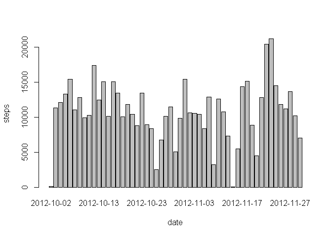
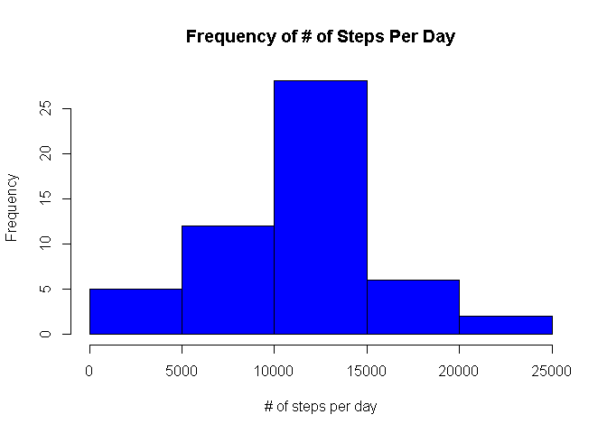
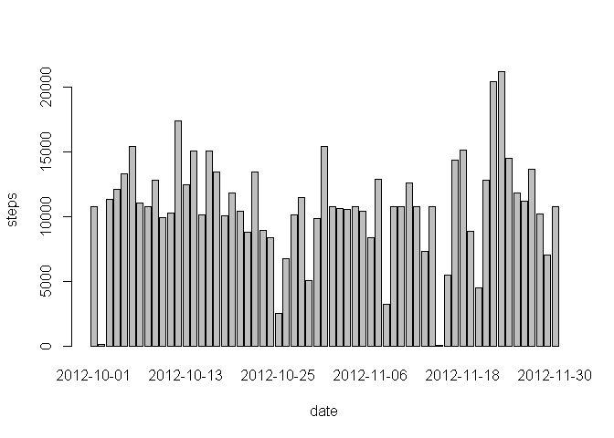
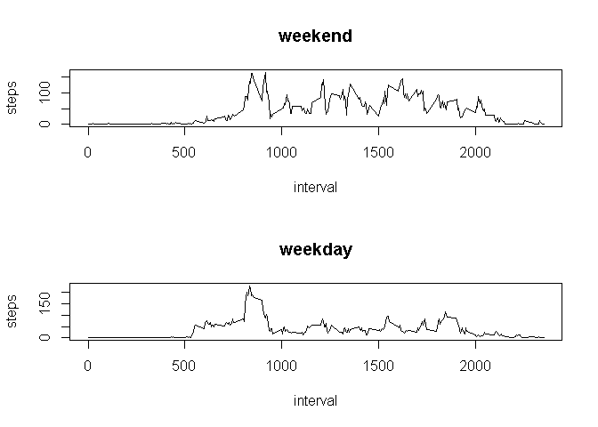

# Reproducible Research: Peer Assessment 1


## Loading and preprocessing the data

```r
setwd("C:/Users/Administrator/Desktop/Coursera/5 - Reproducible Research/RepData_PeerAssessment1")
unzip("activity.zip")
data <- read.csv("activity.csv")
head(data)
```

```
##   steps       date interval
## 1    NA 2012-10-01        0
## 2    NA 2012-10-01        5
## 3    NA 2012-10-01       10
## 4    NA 2012-10-01       15
## 5    NA 2012-10-01       20
## 6    NA 2012-10-01       25
```

## What is mean total number of steps taken per day?

```r
stepsForEachDay <- tapply(data$steps, data$date, sum)
stepsByDate <- aggregate(steps ~ date, data = data, FUN = sum)
barplot(stepsByDate$steps, names.arg = stepsByDate$date, xlab = "date", ylab = "steps")
```

 

```r
hist(stepsForEachDay, breaks = 6, main = "Frequency of # of Steps Per Day", 
     xlab="# of steps per day", ylab="Frequency", col="blue")
```

 

###Mean and Median

```r
meanofstepsperday <- mean(stepsForEachDay, na.rm=TRUE)
medianofstepsperday <- median(stepsForEachDay, na.rm=TRUE)
meanofstepsperday
```

```
## [1] 10766.19
```

```r
medianofstepsperday
```

```
## [1] 10765
```

## What is the average daily activity pattern?

```r
steps.interval <- aggregate(steps ~ interval, data = data, FUN = mean)
plot(steps.interval, type = "l")
```

 


```r
library(plyr)
interval.means <- ddply(data, "interval", summarise,
                        mean=mean(steps, na.rm=TRUE))
idx <- which.max(interval.means$mean)
interval.means[idx,]
```

```
##     interval     mean
## 104      835 206.1698
```

```r
stepIntervals <- interval.means[idx,"interval"]
stepIntervals
```

```
## [1] 835
```

## Imputing missing values
###Missing Values

```r
naRows <- sum(is.na(data$steps))
naRows
```

```
## [1] 2304
```

###Strategy for filling missing values in dataset

```r
activity <- data
activity <- merge(activity, steps.interval, by = "interval", suffixes = c("", 
                                                                          ".y"))
naRows <- is.na(activity$steps)
activity$steps[naRows] <- activity$steps.y[naRows]
activity <- activity[, c(1:3)]
head(activity)
```

```
##   interval    steps       date
## 1        0 1.716981 2012-10-01
## 2        0 0.000000 2012-11-23
## 3        0 0.000000 2012-10-28
## 4        0 0.000000 2012-11-06
## 5        0 0.000000 2012-11-24
## 6        0 0.000000 2012-11-15
```

```r
naRows <- sum(is.na(activity$steps))
naRows
```

```
## [1] 0
```

###Mean and Median of Total Number of Steps Taken Per Day

```r
stepsByDate <- aggregate(steps ~ date, data = activity, FUN = sum)
barplot(stepsByDate$steps, names.arg = stepsByDate$date, xlab = "date", ylab = "steps")
```

 

```r
mean(stepsByDate$steps)
```

```
## [1] 10766.19
```

```r
median(stepsByDate$steps)
```

```
## [1] 10766.19
```

## Are there differences in activity patterns between weekdays and weekends?
###Weekday and Weekend Levels

```r
daytype <- function(date) {
  if (weekdays(as.Date(date)) %in% c("Saturday", "Sunday")) {
    "weekend"
  } else {
    "weekday"
  }
}
activity$daytype <- as.factor(sapply(activity$date, daytype))
```

###Plotted Data

```r
par(mfrow = c(2, 1))
for (type in c("weekend", "weekday")) {
  steps.type <- aggregate(steps ~ interval, data = activity, subset = activity$daytype == 
                            type, FUN = mean)
  plot(steps.type, type = "l", main = type)
}
```

 
